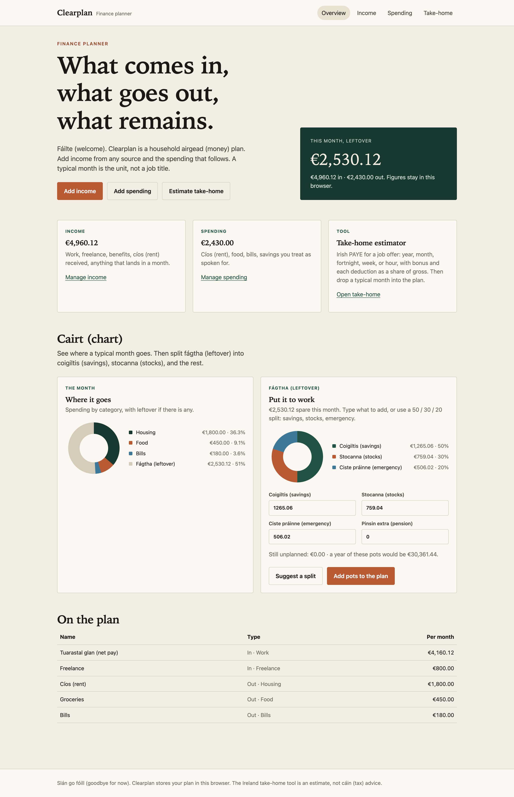
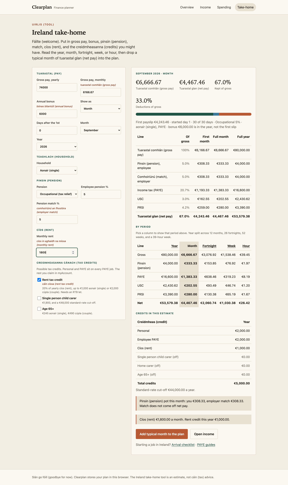
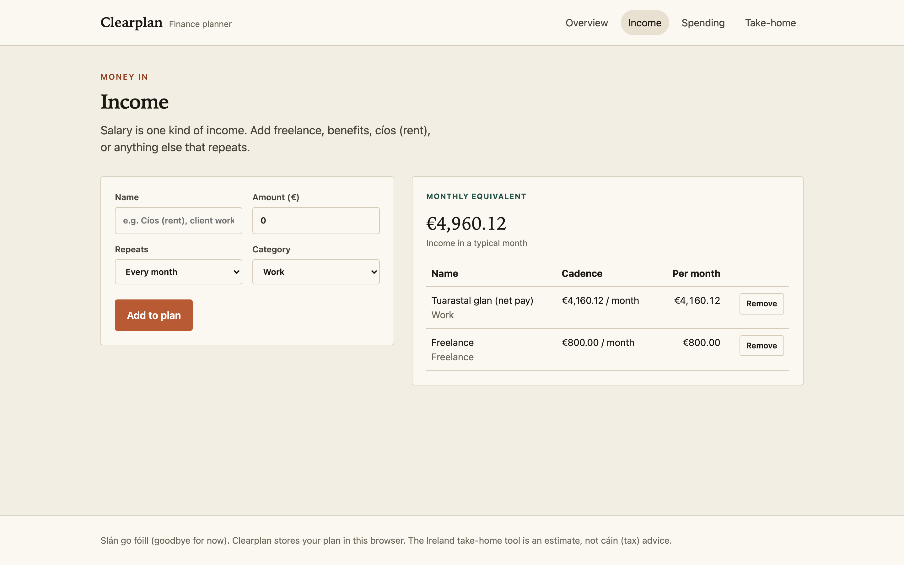

# Clearplan

A household **finance planner**. Money in, money out, leftover in a typical month. Runs entirely in the browser: no account, no API, no Google Fonts.



The Ireland take-home estimator converts a job offer into net pay (year, month, fortnight, week, or hour), with bonus, pension match, rent, and tax credits, then adds a typical month to the plan.



Income and spending are ordinary lines on the same plan. A typical month is the unit, not a job title.



## Run

```bash
cd src/web
npm start
```

Open http://localhost:4200

If `npm` is not on your PATH:

```bash
export PATH="$PWD/.tools:$PATH"
```

Production build (`src/web/dist/web/browser`):

```bash
cd src/web
npm run build
```

Tests:

```bash
cd src/web
npx ng test --no-watch --browsers=ChromeHeadless
```

## Not tax advice

Irish figures use 2026 Revenue bands. Your own payroll will differ.
